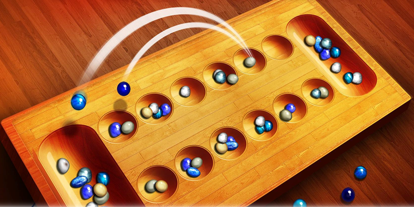

# **Jeu KALAH en langage C**

  

### **Objectif du projet :**
Notre projet a pour objectif principal l’implémentation d’un programme en langage C capable de faire la gestion d’une partie du jeu kalah entre deux joueurs humains, en tenant compte des différentes règles du jeu. Ainsi, Il devra être capable de détecter les fins des parties et d’afficher le nom du joueur qui gagne.

### **Description et règles de jeu :**
La figure ci-dessus représente le plateau du jeu Mancala qui doit être placé entre les deux joueurs dans le sens longitudinal. Le plateau dispose ensuite de sept cases pour chacun des deux joueurs, six cases (piles) sont initialisées par le même nombre de boules (graines) dans le début de chaque partie et une case spéciale représente le Kalah qui sert à stocker les boules gagnantes du chaque joueur.
Les principales règles de ce jeu sont les suivantes :

**1. But du jeu :** Le but est de capturer plus de graines que son adversaire. Le gagnant est celui qui, en fin de partie, a le plus grand nombre de graines.

**2. Répartition des graines :** Au début d’une partie, les graines sont réparties dans les douzes trous à raison d’un nombre égal de pièces dans chaque case.

**3. Tour de jeu :**

* Chaque joueur joue de façon alternative. Le joueur prend toutes les boules d’une case non vide de son choix et les répartit, une par une, dans des cases voisines dans le sens trigonométrique.

* Si la dernière pièce atterrit dans son kalah, il rejoue immédiatement

* Si elle atterrit dans une de ses piles vides, il capture les pièces qui sont dans la pile de l’adversaire faisant face à cette pile vide et les met dans son kalah, ainsi que sa propre dernière pièce.

**4. Fin de partie :** La partie s’arrête également si toutes les piles d’un joueur se trouvent vides quand c’est à lui de jouer. L’autre joueur récupère alors ses propres pièces dans son kalah.
